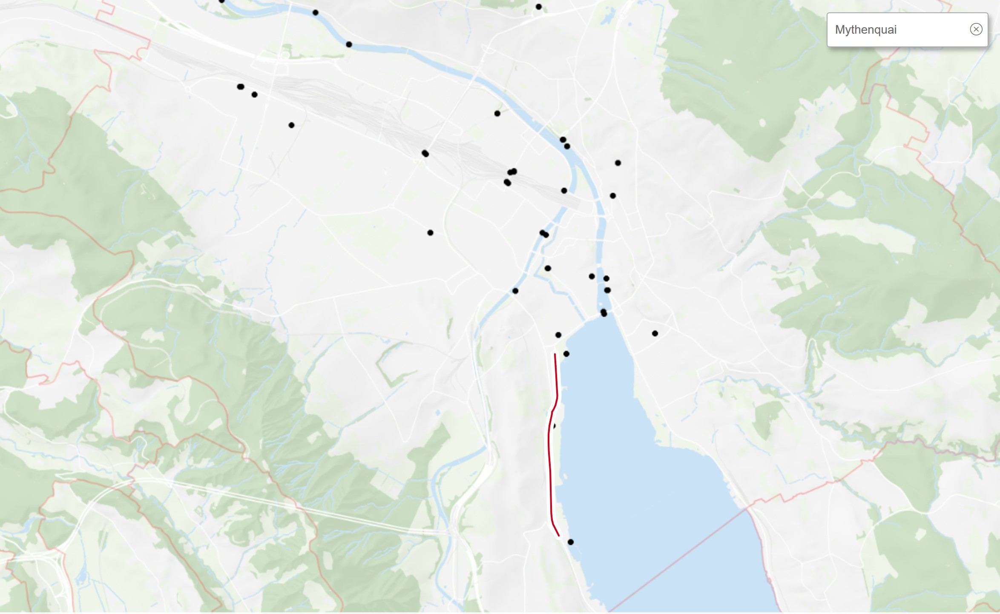

```{r setup, include=FALSE}
library(formatR)
knitr::opts_chunk$set(echo = TRUE)
knitr::opts_chunk$set(cache = TRUE)
knitr::opts_chunk$set(tidy.opts=list(width.cutoff=60),tidy=TRUE)
```


# Introduction

## Scope of this paper

The following paper looks at the influence of the weather on the number of pedestrians and bikers in Zurich for 2019. More specifically, the focus lies on the place of Mythenquai. Mythenquai has been chosen ouf of the reason that both weather measurements as well as data regarding the number of pedestrians / bikers are collected at this very place. This means that there is as little discrepancy between the datasets as possible.

Mythenquai is a road section directly next to Lake Zurich. The counting station for pedestrians and bikers is represented by the black point in the middle of the red line in the picture below:

```{r pressure, echo = FALSE, fig.cap="Screenshot retrieved from https://www.stadt-zuerich.ch/geodaten/download/Standorte_der_automatischen_Fuss__und_Velozaehlungen", out.width = '90%'}

```


## Datasets

**Dataset 1**: 2019_verkehrszaehlungen_werte_fussgaenger_velo.csv  
This document shows the quarter hourly count of pedestrians and bikers passing at different counting stations.  

*Source*: [https://data.stadt-zuerich.ch/dataset/ted_taz_verkehrszaehlungen_werte_fussgaenger_velo/resource/33b3e7d3-f662-43e8-b018-e4b1a254f1f4?inner_span=True](https://data.stadt-zuerich.ch/dataset/ted_taz_verkehrszaehlungen_werte_fussgaenger_velo/resource/33b3e7d3-f662-43e8-b018-e4b1a254f1f4?inner_span=True)

*Columns*  
FK_ZAEHLER 2 levels, pedestrians or bikers  
FK_STANDORT5 stations  
DATUM      data quarter hourly  
VELO_IN    number of bikers, direction in  
VELO_OUT   number of bikers, direction out  
FUSS_IN    number of pedestrians, direction in  
FUSS_OUT   number of pedestrians, direction out  
OST        coordinate according to CH1903+ / LV95  
NORD       coordinate according to CH1903+ / LV95  
  
For computational reasons (as we experienced difficulties in the course of working on this paper, as there were 9 variables with 1264678 observations in the original dataset), a preselection has been done for this data set in Excel. The altered dataset is named ""2019_verkehrszaehlungen_werte_fussgaenger_velo_bereinigt.csv". We selected the rows that have one of the following values in the first row: "ECO09113499", "U15G3104443" or "ECO07091438".

Those are the keys for the counting station at Mythenquai according to the classification file retrieved from [https://www.stadt-zuerich.ch/geodaten/download/Standorte_der_automatischen_Fuss__und_Velozaehlungen](https://www.stadt-zuerich.ch/geodaten/download/Standorte_der_automatischen_Fuss__und_Velozaehlungen).

    
**Dataset 2**: messwerte_mythenquai_2007-2019.csv  
This document shows various variables (air temperature, precipitation, ...) for Mythenquai. The data is collected by the Wasserschutzpolizei Zürich.  

*Source*: [https://data.stadt-zuerich.ch/dataset/69802b3a-bcae-4c28-8a1d-84295676e107/resource/8207b8b4-7993-447d-8a21-5987335aa7ef/download/messwerte_mythenquai_2007-2019.csv](https://data.stadt-zuerich.ch/dataset/69802b3a-bcae-4c28-8a1d-84295676e107/resource/8207b8b4-7993-447d-8a21-5987335aa7ef/download/messwerte_mythenquai_2007-2019.csv)

Again, for computational reasons, a preselection in Excel has been done for this data set as well. Chosen were all data points that were available from the year 2019. Those data points were stored in the following file: wetter.csv.

# Libraries
```{r}
library(dplyr)
library(stringr)
library(ggplot2)
library(lattice)
library(mgcv)
library(plotly)
library(reshape2)
library(tidyverse)
library(caret)
```


# Data Import / Data Cleaning
## Import of the datasets
```{r}
#read in data count of pedestrians and bikers
zaehlung <- read.csv("../01_data/2019_verkehrszaehlungen_werte_fussgaenger_velo_bereinigt.csv", sep=";", header = TRUE)
colnames(zaehlung)[1] <- "FK_ZAEHLER"

#structure of the dataset
str(zaehlung)
head(zaehlung)
```

The head of our dataset indicates that the traffic counting stations did not work for both pedestrians and bikers but only specifically for one of each.

```{r}
#read in data weather
wetter <- read.csv("../01_data/wetter.csv", sep=";", header = TRUE)
#structure of the dataset
str(wetter)
head(wetter)
```

We thus categorise the counting stations accordingly and summarise the data into one shared column.

As the traffic counting stations made a difference whether one went from direction A to B or vice versa (x_IN <-> x_OUT), we take those numbers together as we are solely interested in the total number of pedestrians / bikers. These numbers are stored in the column "UNIDIR" which is an abbreviation for unidirectional.

Third, we categorise the hour indications into categories of the same length (6 hour indications per factor) "morgen" (00:00 - 05:59), "vormittag" (06:00 - 11:59 o`clock), "nachmittag" (12:00 - 17:59 o`clock) and "abend" (18:00 - 23:59 o`clock). 


## Preparation of the datasets

### Prepare dataset pedestrians and bikers
```{r}
##changing the FK_ZAEHLER to an indicator if bike or pedestrians are measured
zaehlung$FK_ZAEHLER <- as.character(zaehlung$FK_ZAEHLER)
zaehlung$FK_ZAEHLER[zaehlung$FK_ZAEHLER == "U15G3104443"] <- "fussgaenger"
zaehlung$FK_ZAEHLER[zaehlung$FK_ZAEHLER == "ECO09113499"] <- "velo"
zaehlung$FK_ZAEHLER[zaehlung$FK_ZAEHLER == "ECO07091438"] <- "velo"
zaehlung$FK_ZAEHLER <- as.factor(zaehlung$FK_ZAEHLER)
zaehlung$FK_STANDORT <- as.factor(zaehlung$FK_STANDORT)

#only show hours not minutes
zaehlung$DATUM <- str_sub(zaehlung$DATUM, end = -4)

#getting the total of movements, independent from their direction
zaehlung[is.na(zaehlung)] <- 0
zaehlung[, "IN"] <- zaehlung[4]+zaehlung[6]
zaehlung[, "OUT"] <- zaehlung[5] + zaehlung[7]
zaehlung[, "UNIDIR"] <- zaehlung[4] + zaehlung [5] + zaehlung[6] +  zaehlung[7]

#new category for the time of day in intervals of 6 hours
zaehlung[, "TAGESZEIT"] <-str_sub(zaehlung$DATUM, 12)
zaehlung$TAGESZEIT[zaehlung$TAGESZEIT  <= "05"] <- "morgen"
zaehlung$TAGESZEIT[zaehlung$TAGESZEIT  <= "11"] <- "vormittag"
zaehlung$TAGESZEIT[zaehlung$TAGESZEIT  <= "17"] <- "nachmittag"
zaehlung$TAGESZEIT[zaehlung$TAGESZEIT  <= "24"] <- "abend"
zaehlung$TAGESZEIT <- as.factor(zaehlung$TAGESZEIT)
```

We further aggregate the data as follows:

```{r}
#calculate the total of movements of pedestrians and bikers hourly
aggregated_listFK <- aggregate(UNIDIR ~ FK_ZAEHLER + TAGESZEIT + OST + NORD + FK_STANDORT + DATUM, zaehlung, sum)
```


### Prepare dataset weather
```{r}
wetter$timestamp_cet <- str_sub(wetter$timestamp_cet, end = -7)
```

```{r}
#aggregate the variables wind, air temperature, precipitation and humidity
aggregated_Wind <- aggregate(wind_force_avg_10min ~ timestamp_cet, wetter, FUN = mean)
aggregated_Temp <- aggregate(air_temperature ~ timestamp_cet, wetter, FUN = mean)
aggregated_Prec <- aggregate(precipitation ~ timestamp_cet, wetter, sum)
aggregated_Hum <- aggregate(humidity ~ timestamp_cet, wetter, FUN = mean)

#join wind, air temperature, precipitation and humidity to the dataset
aggregated_wetter_Wind_Temp <- left_join(aggregated_Wind, aggregated_Temp, by = "timestamp_cet")
aggregated_wetter_Wind_Temp_Prec <- left_join(aggregated_wetter_Wind_Temp, aggregated_Prec, by = "timestamp_cet")
aggregated_wetter_Wind_Temp_Prec_Hum <- left_join(aggregated_wetter_Wind_Temp_Prec, aggregated_Hum, by = "timestamp_cet")
```

Again, an aggregation has been done in order to grant the functioning of the next step:

### Joining both datasets together
```{r}
join_zaehlung_wetter_fulldata <- left_join(aggregated_listFK, aggregated_wetter_Wind_Temp_Prec_Hum, by = c("DATUM" = "timestamp_cet"))
```

```{r}
join_zaehlung_wetter_fulldata$month <- str_sub(join_zaehlung_wetter_fulldata$DATUM, end = -7)
```
```{r}
#add new category month
join_zaehlung_wetter_fulldata$month <- as.character(join_zaehlung_wetter_fulldata$month)
join_zaehlung_wetter_fulldata$month[join_zaehlung_wetter_fulldata$month <= "2019-01"] <- "Januar"
join_zaehlung_wetter_fulldata$month[join_zaehlung_wetter_fulldata$month <= "2019-02"] <- "Februar"
join_zaehlung_wetter_fulldata$month[join_zaehlung_wetter_fulldata$month <= "2019-03"] <- "März"
join_zaehlung_wetter_fulldata$month[join_zaehlung_wetter_fulldata$month <= "2019-04"] <- "April"
join_zaehlung_wetter_fulldata$month[join_zaehlung_wetter_fulldata$month <= "2019-05"] <- "Mai"
join_zaehlung_wetter_fulldata$month[join_zaehlung_wetter_fulldata$month <= "2019-06"] <- "Juni"
join_zaehlung_wetter_fulldata$month[join_zaehlung_wetter_fulldata$month <= "2019-07"] <- "Juli"
join_zaehlung_wetter_fulldata$month[join_zaehlung_wetter_fulldata$month <= "2019-08"] <- "August"
join_zaehlung_wetter_fulldata$month[join_zaehlung_wetter_fulldata$month <= "2019-09"] <- "September"
join_zaehlung_wetter_fulldata$month[join_zaehlung_wetter_fulldata$month <= "2019-10"] <- "Oktober"
join_zaehlung_wetter_fulldata$month[join_zaehlung_wetter_fulldata$month <= "2019-11"] <- "November"
join_zaehlung_wetter_fulldata$month[join_zaehlung_wetter_fulldata$month <= "2019-12"] <- "Dezember"
join_zaehlung_wetter_fulldata$month <- as.factor(join_zaehlung_wetter_fulldata$month)


join_zaehlung_wetter <- subset(join_zaehlung_wetter_fulldata, month == "Februar"| month == "März" | month == "April" | month == "Mai" | month == "Juni" | month == "Juli")

join_zaehlung_wetter[c("4351"),] <- join_zaehlung_wetter[c("4350"),]
summary(is.na(join_zaehlung_wetter$precipitation)) 

#complete dataset
head(join_zaehlung_wetter)
```

In the above step, we select to only focus on half a year (February to July). The focus of this selection is somewhat arbitrary.


# Research question
Does air temperature influence the number of pedestrians and bikers counted at the counting station Mythenquai in Zurich?

# Graphical Analysis

We first take a look at the distribution of variables that are of interest to us separately. 

```{r}
histogram(~ air_temperature, data=join_zaehlung_wetter, xlab = "Air temperature", main="Distribution of air temperature", breaks = 20)
```

Air temperature does not occur uniformely distributed. This illustration shows that the air temperature follows approximately a normal distribution instead.

```{r}
histogram(~ join_zaehlung_wetter$UNIDIR, xlim = c(0,250), breaks = 250, xlab = "UNIDIR", labels = TRUE, main="Distribution of the unidirectional count of pedestrians & bikers", col="orange")
```

The above illustration indicates that the data follows approximately an 1/x function and would need a log-transformation in order to be approximately normal-distributed. However, this is at this point not required.

We further take a look at how these two variables appear in a combined version:

```{r}
#air temperature
ggplot(join_zaehlung_wetter, aes(air_temperature, UNIDIR)) + 
  geom_point(alpha = 0.05, color="darkblue") + 
  ggtitle("Does air temperature affect the number of bikers and pedestrians?") + 
  xlab("Air temperature") + 
  ylab("UNIDIR") + 
  geom_smooth(method = "lm", colour = "red")
```

As the above illustration shows, the data is not really uniformely distributed so that one cannot really recognize a specific pattern. However,  generally spoken, higher y-values are rather reached by points that are rather on the right side of the x-axis, indicating that there is a positive correlation between temperature and number of pedestrians / bikers.

As the extreme outliers distort the above illustration considerably, we take a closer look at how the points are distributed with an upper margin of 250 pedestrians and bikers per hour:

```{r}
ggplot(join_zaehlung_wetter, aes(air_temperature, UNIDIR)) + 
  geom_point(alpha = 0.05, color="darkblue") + 
  ggtitle("Does air temperature affect the number of bikers and pedestrians?") + 
  xlab("Air temperature") + 
  ylab("UNIDIR") + 
  ylim(c(0,250)) + 
  geom_smooth(method = "lm", colour = "red")
```

A simple regression line further shows a positive slope, meaning the positive correlation between air temperature and total count of pedestrians and bikers is strengthened.
Furthermore, we take into account the time of the day:

```{r}
join_zaehlung_wetter %>%
  arrange(UNIDIR) %>%
  mutate(TAGESZEIT = factor(TAGESZEIT, levels=c("morgen", "vormittag", "nachmittag", "abend"))) %>%
  ggplot(aes(air_temperature, UNIDIR, colour = factor(TAGESZEIT))) + geom_smooth(method = "lm", colour = "red") +
    labs(title = "Bikers and pedestrians by time of day", x = "Air temperature") +
    geom_point(alpha=I(0.05)) +
    facet_grid(. ~ TAGESZEIT) +
    scale_y_continuous(limits=c(0,250))
```

Whereas for mornings and evenings, the occurences are mainly between 0 - 50 counted bikers or pedestrians, the range is more wide for the time around noon (6:00 to 12:00 and 12:00 to 18:00). 
These are of course also the hours where most people go to work or school. However, considering the x-axis aka temperature, it becomes more apparent that there seems to be a positive correlation between temperature and number of pedestrians / bikers.

This seems to be true for both pedestrians as well as bikers as the distribution does not differ in a considerate way:


```{r}
qplot(y = UNIDIR, x = air_temperature, xlab = "Air temperature", data = join_zaehlung_wetter, facets = ~ FK_ZAEHLER, col = FK_ZAEHLER, ylim = c(0,250), alpha=I(0.05))
```

```{r}
join_zaehlung_wetter %>%
  arrange(UNIDIR) %>%
  mutate(month = factor(month, levels=c("Februar", "März", "April", "Mai", "Juni", "Juli"))) %>%
  ggplot(aes(air_temperature, UNIDIR, colour = factor(month))) +
    geom_point(alpha=I(0.05)) + geom_smooth(method = "lm", colour = "red") +
    labs(title = "Bikers and pedestrians by month", x = "Air temperature") +
    facet_grid(. ~ month, margins = TRUE, drop = FALSE) + 
    scale_y_continuous(limits=c(0,250))

```

In the above illustration, one can directly see the distribution of temperature per month as well as the number of counted people. 
By eye, it seems that in months where the distribution is more on the right handside, the points are darker as well as distributed higher on the y-axis.


# Simple regression

```{r}
#comparison of bikers and pedestrians
boxplot(UNIDIR ~ FK_ZAEHLER, ylim = c(0,250), data = join_zaehlung_wetter)
## running the test
t.test(UNIDIR ~ FK_ZAEHLER, data = join_zaehlung_wetter)
```
In the boxplot it can be seen that the median of the count of bikers is slightly higher than the count of pedestrians. This is also shown in the t-test which indicates, that the true difference is not equal to zero as the p-value is very small.


```{r}
lm.join_zaehlung_wetter <- lm(UNIDIR ~ air_temperature, data = join_zaehlung_wetter)
summary(lm.join_zaehlung_wetter)
```

There is strong evidence, that the mean growth rate for air temperature is not equal to zero. If the count increases by 1, the average air temperature would increase by 5.8 degrees. The intercept is outside of the data range, therefore the interpretation that by an air temperature of 5.8 degrees there is a count of -27.6 bikers and pedestrians makes not much sense as there is no negative count. 

```{r}
join_zaehlung_wetter$predicted <- predict(lm.join_zaehlung_wetter)
join_zaehlung_wetter$residuals <- residuals(lm.join_zaehlung_wetter)
```


```{r}
ggplot(join_zaehlung_wetter, aes(x = air_temperature, y = UNIDIR)) +
  geom_smooth(method = "lm", se = FALSE, color = "darkgrey") +
  geom_segment(aes(xend = air_temperature, yend = predicted), alpha = .2) +
  #geom_point(aes(color = abs(residuals), size = abs(residuals))) +
  #scale_color_continuous(low = "green", high = "red") +
  geom_point(aes(color = residuals)) +
  scale_color_gradient2(low = "blue", mid = "white", high = "red") +
  guides(color = FALSE, size = FALSE) +
  geom_point(aes(y = predicted), shape = 1) +
  labs(title = "Residual analysis", x = "Air temperature") +
  theme_bw()
```

There are many data points where the actual values are greater than what is being predicted. There is some blue at the end of the spectre, indicating that the actual values are less than what is being predicted. This suggests hat the relationship might be non-linear.

```{r}
rss.lin <- sum((lm.join_zaehlung_wetter$residuals)^2)
mse.lin <- rss.lin/length(join_zaehlung_wetter$residuals)
rmse.lin <- sqrt(mse.lin)

rss.lin
mse.lin
rmse.lin
```


# Multiple Linear Regression

In the further step, we add a further variable: We look at the relationship of precipitation and temperature to the number of bikers / pedestrians. By this, we also see what happens to a model if one adds a further variable:

```{r}
interactive_graph <- plot_ly(data.frame(join_zaehlung_wetter), x = ~precipitation, y = ~air_temperature, z = ~UNIDIR, alpha = 0.3) %>%
  add_markers() %>%
  layout(scene = list(xaxis = list(title = 'Precipitation'),
                      yaxis = list(title = 'Air temperature'),
                      zaxis = list(title = 'UNIDIR')))


unidir_lm <- lm(UNIDIR ~ precipitation + air_temperature, data = join_zaehlung_wetter)
graph_reso <- 0.05

```

```{r}
#Setup Axis
axis_x <- seq(from = min(join_zaehlung_wetter$precipitation), to = max(join_zaehlung_wetter$precipitation), by = graph_reso)
axis_y <- seq(min(join_zaehlung_wetter$air_temperature), max(join_zaehlung_wetter$air_temperature), by = graph_reso)

#Sample points
unidir_lm_surface <- expand.grid(precipitation = axis_x, air_temperature = axis_y, KEEP.OUT.ATTRS = F)
unidir_lm_surface$UNIDIR <- predict.lm(unidir_lm, newdata = unidir_lm_surface)
unidir_lm_surface <- acast(unidir_lm_surface, air_temperature ~ precipitation, value.var = "UNIDIR")

interactive_graph <- add_trace(p = interactive_graph,
                       z = unidir_lm_surface,
                       x = axis_x,
                       y = axis_y,
                       type = "surface")

interactive_graph

```

The regression plane as above indicates already what can also be seen in below formula: Temperature is positively correlated with higher number of pedestrians / bikers whereas precipitation is negatively correlated:

```{r}
unidir_lm
```

We have a look at how good our regression plane fits the data points given:

```{r}
rss.multiregression <- sum((unidir_lm$residuals)^2)
mse.multiregression <- rss.multiregression/length(unidir_lm$residuals)
rmse.multiregression <- sqrt(mse.multiregression)

rss.multiregression
mse.multiregression
rmse.multiregression
```
Between the simple linear regression (72.24253) and the multiple linear regression (72.14376) is hardly any difference in the performance. 

# Generalised Additive Model
```{r}
gam.model1 <- gam(UNIDIR ~ precipitation + s(air_temperature), data = join_zaehlung_wetter)


rss.gam <- sum((gam.model1$residuals)^2)
mse.gam <- rss.gam/length(gam.model1$residuals)
rmse.gam <- sqrt(mse.gam)

rss.gam
mse.gam
rmse.gam

```


In comparison with the analysis of the residuals of the multiple regression (with an RMSE of 72.14), a GAM modell performs better in terms of fitting the points to a model as the modell RMSE (residual mean squared error) is at 65.3815.


```{r}
plot.gam(gam.model1, select = 1, rug = TRUE, shade = TRUE, shade.col = "yellow", residuals = TRUE, xlab = "Air temperaturee")
```

With cross validation we almost get the same result.
```{r}
#Cross validation for linear regression

set.seed(123) 
lin.train.control <- trainControl(method = "cv", number = 10)
gam.train.control <- trainControl(method = "cv", number = 10)

#Cross validation for linear regression
cv.lin.model <- train(UNIDIR ~ air_temperature, data = join_zaehlung_wetter, method = "lm",
               trControl = lin.train.control)
#cross validation for gam model
cv.gam.model <- train(UNIDIR ~ precipitation + air_temperature, data = join_zaehlung_wetter, method = "gam",
                trControl = gam.train.control)
# Summarize the results
print(cv.lin.model)
print(cv.gam.model)
```


# Results

The models in this paper suggest that the influence of temperature on pedestrians / bikers is positive. For precipitation, the opposite is true: the more precipitation, the less pedestrians / bikers. Of course, correlation is not causality. Neither do temperature or precipitation explain the outliers. Meaning there must be more for the motivation to go outside (by foot or bike) than simply the variables discussed.


# Discussion

These analysis are very reliant on the quality of the data, meaning how the data was collected. For this very thing, no additional information could be found, so we are not 100% sure how the counting stations worked, if they counted double etc. Furthermore, the correction factors for the analysed time span is not available yet. 

What neither is considered in this paper are the effects of like air temperature or precipiation on other factors such as if streets have become icy.

Such questions would surely be interesting to be analysed in a further paper. One could also specially take into account days where there is a high traffic of pedestrians and bikers like for example the Street Parade in Zurich.  