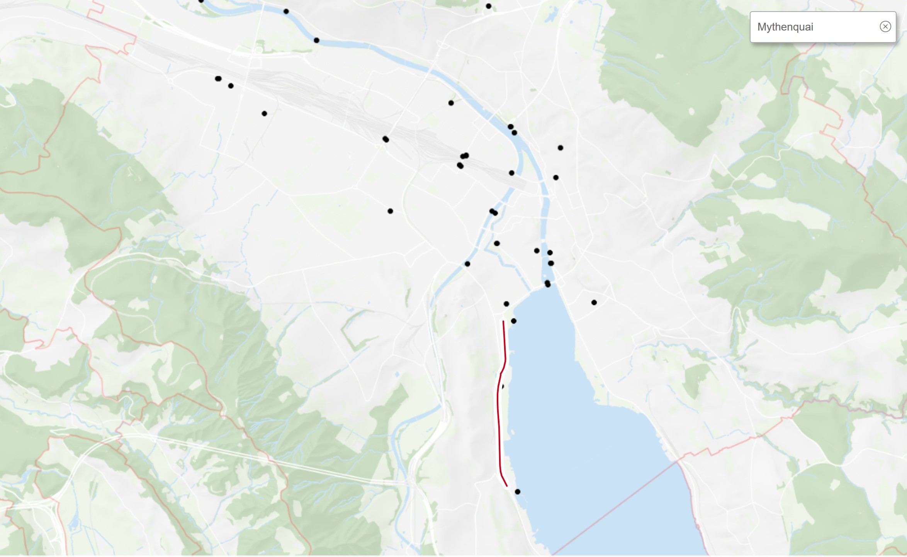

```{r setup, include=FALSE}
knitr::opts_chunk$set(echo = TRUE)
knitr::opts_chunk$set(cache = TRUE)
```


# Introduction

## Scope of this paper

The following paper looks at the influence of the weather on the number of pedestrians and bikers in Zurich for 2019. More specifically, the focus lies on the place of Mythenquai. Mythenquai has been chosen ouf of the reason that both weather measurements as well as data regarding the number of pedestrians / bikers are collected at this very place. This means that there is as little discrepancy between the datasets as possible.

Mythenquai is a section of road, directly next to Lake Zurich. The counting station for pedestrians and bikers is represented by the black pint in the middle of below red line:

```{r pressure, echo = FALSE, fig.cap="Screenshot retrieved from https://www.stadt-zuerich.ch/geodaten/download/Standorte_der_automatischen_Fuss__und_Velozaehlungen", out.width = '90%'}

```


## Datasets

**Dataset 1**: 2019_verkehrszaehlungen_werte_fussgaenger_velo.csv  
This document shows the quarter hourly count of pedestrians and bikers passing at different counting stations.  

*Source*: [https://data.stadt-zuerich.ch/dataset/ted_taz_verkehrszaehlungen_werte_fussgaenger_velo/resource/33b3e7d3-f662-43e8-b018-e4b1a254f1f4?inner_span=True](https://data.stadt-zuerich.ch/dataset/ted_taz_verkehrszaehlungen_werte_fussgaenger_velo/resource/33b3e7d3-f662-43e8-b018-e4b1a254f1f4?inner_span=True)

*Columns*  
FK_ZAEHLER 2 levels, pedestrians or bikers  
FK_STANDORT5 stations  
DATUM      data quarter hourly  
VELO_IN    number of bikers, direction in  
VELO_OUT   number of bikers, direction out  
FUSS_IN    number of pedestrians, direction in  
FUSS_OUT   number of pedestrians, direction out  
OST        coordinate according to CH1903+ / LV95  
NORD       coordinate according to CH1903+ / LV95  
  
For computational reasons (as we experienced difficulties is the course of working on this paper as there are 9 variables with 1264678 observations in the original dataset), a preselection has been done for this data set in Excel. The altered dataset is named ""2019_verkehrszaehlungen_werte_fussgaenger_velo_bereinigt.csv". We selected the rows that have one of the following values in the first row: "ECO09113499", "U15G3104443" or "ECO07091438".

Those are the keys for the counting station at Mythenquai according to the classification file retrieved from [https://www.stadt-zuerich.ch/geodaten/download/Standorte_der_automatischen_Fuss__und_Velozaehlungen](https://www.stadt-zuerich.ch/geodaten/download/Standorte_der_automatischen_Fuss__und_Velozaehlungen).

    
**Dataset 2**: messwerte_mythenquai_2007-2019.csv  
This document shows various variables (air temperature, precipitation, ...) for Mythenquai. Data are collected by the Wasserschutzpolizei Zürich.  

*Source*: [https://data.stadt-zuerich.ch/dataset/69802b3a-bcae-4c28-8a1d-84295676e107/resource/8207b8b4-7993-447d-8a21-5987335aa7ef/download/messwerte_mythenquai_2007-2019.csv](https://data.stadt-zuerich.ch/dataset/69802b3a-bcae-4c28-8a1d-84295676e107/resource/8207b8b4-7993-447d-8a21-5987335aa7ef/download/messwerte_mythenquai_2007-2019.csv)

Again, for computational reasons, a preselection in Excel has been done for this data set as well. Chosen were all data points that were available from the year 2019. Those data points were stored in the following file: wetter.csv.


# Libraries
```{r}
library(dplyr)
library(stringr)
library(dplyr)
library(ggplot2)
library(lattice)

```


# Data Import / Data Cleaning
```{r}
#read in data
zaehlung <- read.csv("2019_verkehrszaehlungen_werte_fussgaenger_velo_bereinigt.csv", sep=";", header = TRUE)
colnames(zaehlung)[1] <- "FK_ZAEHLER"


#structure of the dataset
str(zaehlung)
head(zaehlung)
```

The head of our dataset indicates that the traffic counters did not work for both pedestrians and bikers but only specifically for one of each.


```{r}
wetter <- read.csv("wetter.csv", sep=";", header = TRUE)
#structure of the dataset
str(zaehlung)
head(zaehlung)
```

. We thus categorize the counting stations accordingly and summarize the data into one shared column.

As the traffic counters further made a difference whether one went from direction A to B or vice versa (x_IN <-> x_OUT), we take those numbers together as we are solely interested in the total number of pedestrians / bikers. These numbers are stored in the column "UNIDIR" which is an abbreviation for unidirectional.

Third, we categorize the hour indications into categories of the same length (6 hour indications per factor) "morgen", "vormittag", "nachmittag" and "abend". 


## Preparation of the datasets
```{r}
#1.1.1 Prepare dataset pedestrians and bikers
##changing the FK_ZAEHLER to an indicator if bike or pedestrians are measured
zaehlung$FK_ZAEHLER <- as.character(zaehlung$FK_ZAEHLER)
zaehlung$FK_ZAEHLER[zaehlung$FK_ZAEHLER == "U15G3104443"] <- "fussgaenger"
zaehlung$FK_ZAEHLER[zaehlung$FK_ZAEHLER == "U15G3104446"] <- "fussgaenger"
zaehlung$FK_ZAEHLER[zaehlung$FK_ZAEHLER == "ECO09113499"] <- "velo"
zaehlung$FK_ZAEHLER[zaehlung$FK_ZAEHLER == "ECO07091438"] <- "velo"
zaehlung$FK_ZAEHLER <- as.factor(zaehlung$FK_ZAEHLER)
zaehlung$FK_STANDORT <- as.factor(zaehlung$FK_STANDORT)

#only show hours not minutes
zaehlung$DATUM <- str_sub(zaehlung$DATUM, end = -4)

#getting the total of movements, independent from their direction
zaehlung[is.na(zaehlung)] <- 0
zaehlung[, "IN"] <- zaehlung[4]+zaehlung[6]
zaehlung[, "OUT"] <- zaehlung[5] + zaehlung[7]
zaehlung[, "UNIDIR"] <- zaehlung[4] + zaehlung [5] + zaehlung[6] +  zaehlung[7]

#
zaehlung[, "TAGESZEIT"] <-str_sub(zaehlung$DATUM, 12)
zaehlung$TAGESZEIT[zaehlung$TAGESZEIT  <= "06"] <- "morgen"
zaehlung$TAGESZEIT[zaehlung$TAGESZEIT  <= "12"] <- "vormittag"
zaehlung$TAGESZEIT[zaehlung$TAGESZEIT  <= "18"] <- "nachmittag"
zaehlung$TAGESZEIT[zaehlung$TAGESZEIT  <= "24"] <- "abend"
zaehlung$TAGESZEIT <- as.factor(zaehlung$TAGESZEIT)

head(zaehlung)
```


```{r}
#calculate the total of movements of pedestrians and bikers hourly
aggregated_listFK <- aggregate(UNIDIR ~ FK_ZAEHLER + TAGESZEIT + OST + NORD + FK_STANDORT + DATUM, zaehlung, sum)

```

```{r}
#1.1.2 Prepare dataset Weather

#wetter$wind_force_avg_10min <- as.factor(wetter$wind_force_avg_10min)
#apply(wetter, MARGIN = 2, FUN = anyNA)

#only show hours not minutes
wetter$timestamp_cet <- str_sub(wetter$timestamp_cet, end = -7)

```

```{r}
#calculate the mean of wind force, air temperature and humidity per hour, and the sum of precipitation per hour

#aggregated_listWETTER <- aggregate(timestamp_cet ~ wind_force_avg_10min + air_temperature + precipitation, wetter, FUN = "mean")

aggregated_Wind <- aggregate(wind_force_avg_10min ~ timestamp_cet, wetter, FUN = mean)
aggregated_Temp <- aggregate(air_temperature ~ timestamp_cet, wetter, FUN = mean)
aggregated_Prec <- aggregate(precipitation ~ timestamp_cet, wetter, sum)
aggregated_Hum <- aggregate(humidity ~ timestamp_cet, wetter, FUN = mean)

#aggregate <- wetter$aggregated_Wind, wetter$aggregated_Temp, wetter$aggregated_Prec

aggregated_wetter_Wind_Temp <- left_join(aggregated_Wind, aggregated_Temp, by = "timestamp_cet")
aggregated_wetter_Wind_Temp_Prec <- left_join(aggregated_wetter_Wind_Temp, aggregated_Prec, by = "timestamp_cet")
aggregated_wetter_Wind_Temp_Prec_Hum <- left_join(aggregated_wetter_Wind_Temp_Prec, aggregated_Hum, by = "timestamp_cet")
head(aggregated_wetter_Wind_Temp_Prec_Hum)
#View(aggregated_wetter_Wind_Temp_Prec)

#old test code: aggregati <- aggregate(wetter$timestamp_cet)
#old test code: aggregati

```


```{r}
#1.1.3 joining both datasets together
join_zaehlung_wetter <- left_join(aggregated_listFK, aggregated_wetter_Wind_Temp_Prec_Hum, by = c("DATUM" = "timestamp_cet"))
head(join_zaehlung_wetter)
```

```{r}
join_zaehlung_wetter$month <- str_sub(join_zaehlung_wetter$DATUM, end = -7)
head(join_zaehlung_wetter)
```
```{r}
join_zaehlung_wetter$month <- as.character(join_zaehlung_wetter$month)
join_zaehlung_wetter$month[join_zaehlung_wetter$month <= "2019-01"] <- "Januar"
join_zaehlung_wetter$month[join_zaehlung_wetter$month <= "2019-02"] <- "Februar"
join_zaehlung_wetter$month[join_zaehlung_wetter$month <= "2019-03"] <- "März"
join_zaehlung_wetter$month[join_zaehlung_wetter$month <= "2019-04"] <- "April"
join_zaehlung_wetter$month[join_zaehlung_wetter$month <= "2019-05"] <- "Mai"
join_zaehlung_wetter$month[join_zaehlung_wetter$month <= "2019-06"] <- "Juni"
join_zaehlung_wetter$month[join_zaehlung_wetter$month <= "2019-07"] <- "Juli"
join_zaehlung_wetter$month[join_zaehlung_wetter$month <= "2019-08"] <- "August"
join_zaehlung_wetter$month[join_zaehlung_wetter$month <= "2019-09"] <- "September"
join_zaehlung_wetter$month[join_zaehlung_wetter$month <= "2019-10"] <- "Oktober"
join_zaehlung_wetter$month[join_zaehlung_wetter$month <= "2019-11"] <- "November"
join_zaehlung_wetter$month[join_zaehlung_wetter$month <= "2019-12"] <- "Dezember"
join_zaehlung_wetter$month <- as.factor(join_zaehlung_wetter$month)

head(join_zaehlung_wetter)

```

### 2. Graphical Analysis
##### **2.2 Scatterplot**
```{r}
#air temperature
ggplot(join_zaehlung_wetter, aes(air_temperature, UNIDIR)) + geom_point(alpha = 0.05, color="darkblue") + ggtitle("Does air temperature affect the number of bikers and pedestrians?") + xlab("Air temperature") + ylab("Total count of ped. + bikers") 

     # pch = 8,
     # col = "darkblue",
     # cex = 0.5, 
     # main = ,
     # ylab = 
     # xlab = ,
     # xlim = c(0,30)
#abline
#plot(aggregated_wetter_Wind_Temp_Prec_Hum$air_temperature, aggregated_wetter_Wind_Temp_Prec_Hum$UNIDIR, main = "...")
```

As the above illustration shows, the data is not really uniformely distributed so that one cannot really recognize a specific pattern.


However, these hints need to be considered with attention. So it is that one has not taken into account yet at this point that the air temperature does not occur uniformely distributed.


As the extreme outliers distort the above illustration considerably, we take a closer look at how the points are distributed with an upper margin of 250 pedestrians and bikers per hour:

```{r}
ggplot(join_zaehlung_wetter, aes(air_temperature, UNIDIR)) + geom_point(alpha = 0.05, color="darkblue") + ggtitle("Does air temperature affect the number of bikers and pedestrians?") + xlab("Air temperature") + ylab("Total count of ped. + bikers") + ylim(c(0,250))           
```

```{r}
histogram(~ air_temperature, data=join_zaehlung_wetter, xlab = "Air temperatur [°C]", main="Distribution of air temperature", breaks = 20)
```

As mentioned above, air temperature does not occur uniformely distributed. This illustration shows that the air temperature follow approximately a normal distribution instead.

```{r}
histogram(~ join_zaehlung_wetter$UNIDIR, xlim = c(0,250), breaks = 250, xlab = "Counted number of pedestrians & bikers per hour", labels = TRUE, main="Distribution of the unidirectional count of pedestrians & bikers", col="orange")

```

The above illustration indicates that the data follows approximately an 1/x function. To normalize the data distribution for the unidirectional count of pedestrians & bikers, we logarithmize it to get appropr. normally distributed data.


```{r}
join_zaehlung_wetter$UNIDIR_log <- log(join_zaehlung_wetter$UNIDIR)
histogram(~ join_zaehlung_wetter$UNIDIR_log, main = "Distribution of the unidirectional count of pedestrians & bikers (logarithmized)", col="orange")
```


```{r}
## {ggplot2} ##
par(mfrow = c(2, 2))
qplot(y = UNIDIR, x = air_temperature, xlab = "Air temperature", data = join_zaehlung_wetter, facets = ~ TAGESZEIT, col = TAGESZEIT, ylim = c(0,250),alpha=I(0.05))
```

```{r}
qplot(y = UNIDIR, x = air_temperature, xlab = "Air temperature", data = join_zaehlung_wetter, facets = ~ FK_ZAEHLER, col = FK_ZAEHLER, ylim = c(0,250), alpha=I(0.05))
```

```{r}
xyplot(UNIDIR ~ air_temperature, groups = TAGESZEIT, data = join_zaehlung_wetter)
```

```{r}
ggplot(data = join_zaehlung_wetter,
       mapping = aes(y = UNIDIR,   #aes us easthetics
                     x = air_temperature,
                     colour = TAGESZEIT)) +
  geom_point()

```

```{r}
ggplot(data = join_zaehlung_wetter,
       mapping = aes(y = UNIDIR,   #aes us easthetics
                     x = air_temperature,
                     colour = TAGESZEIT)) +
  geom_line()
```

```{r}
ggplot(data = join_zaehlung_wetter,
       mapping = aes(y = UNIDIR,   #aes us easthetics
                     x = air_temperature,
                     group = TAGESZEIT)) +
  geom_line()
```

```{r}
ggplot(data = join_zaehlung_wetter,
       mapping = aes(y = UNIDIR,   #aes us easthetics
                     x = air_temperature)) +
                     
  geom_point() +
  geom_smooth()
```


```{r}
#humidity
plot(UNIDIR ~ humidity, data = join_zaehlung_wetter,
     pch = 8,
     col = "darkblue",
     cex = 0.5, 
     main = "Does humidity make a different to the count of bikers and pedestrians?", 
     ylab = "Total count of ped. + bikers",
     xlab = " Humidity in ??")
```

Interpretation:

```{r}
par(mfrow = c(2, 2))
qplot(y = UNIDIR, x = humidity, data = join_zaehlung_wetter, facets = ~ TAGESZEIT, col = TAGESZEIT)
qplot(y = UNIDIR, x = humidity, data = join_zaehlung_wetter, facets = ~ FK_ZAEHLER, col = FK_ZAEHLER)
```

```{r}
#precipitation
plot(UNIDIR ~ precipitation, data = join_zaehlung_wetter,
     pch = 8,
     col = "darkblue",
     cex = 0.5, 
     main = "Does precipitation make a different to the count of bikers and pedestrians?",
     ylab = "Total count of ped. + bikers",
     xlab = "Precipitation in ml")
```

Interpretation:

```{r}
qplot(y = UNIDIR, x = precipitation, data = join_zaehlung_wetter, facets = ~ TAGESZEIT, col = TAGESZEIT)
qplot(y = UNIDIR, x = precipitation, data = join_zaehlung_wetter, facets = ~ FK_ZAEHLER, col = FK_ZAEHLER)
```


```{r}

qplot(y = UNIDIR, x = air_temperature, xlab = "Air temperature", data = join_zaehlung_wetter, facets = ~ month, col = month,alpha=I(0.05))
```


Discussion: very reliant on the quality of the data. (We do not know exactly how the counting stations worked --> ). Correction factors for the analysed time span is not available yet. 